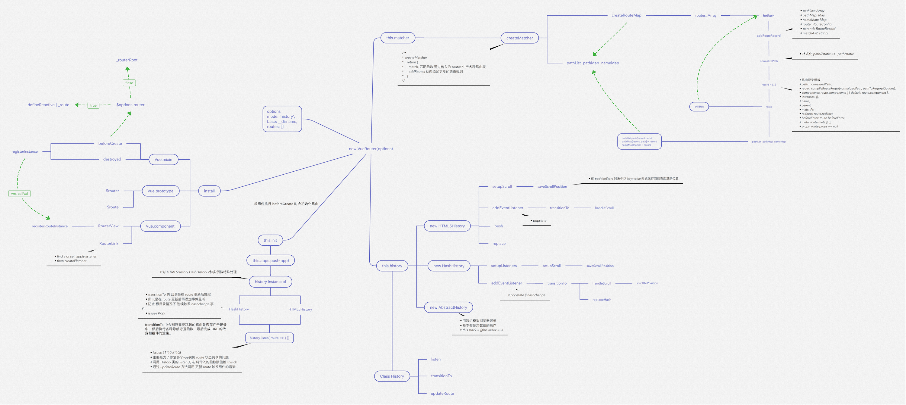

---
  ebook:
    title: interview-Vue
    author: ykk
---

# Vue

## NextTick 原理分析

`nextTick` 可以让我们在下次 DOM 更新循环结束之后执行回调，用于获得更新后的 DOM。

在 Vue2.4 之前都是使用的 microtask，但是 microtask 的优先级过高，在某些情况下可能会出现比时间冒泡更快的情况，但是如果都使用 macrotask 有可能会出现渲染的性能问题。所以在新版本中，会默认使用 microtask，但是在特殊情况下会使用 macrotasks,比如 v-on。

对于实现 macrotasks，会先判断是否能使用 `setImmediate`，不能的话降级为 `MessageChannel`，以上都不行的话就使用 `setTimeout`

```js
if (typeof setImmediate !== 'undefined' && isNative(setImmediate)) {
  macroTimeFunc = () => {
    setImmediate(flushCallbacks)
  }
} else if (
  typeof MessageChannel !== 'undefined' &&
  (isNative(MessageChannel) ||
    // PhotomJS
    MessageChannel.toString() === '[object MessageChannelConstructor]')
){
  const channel = new MessageChannel()
  const port = channel.port2
  channel.port1.onmessage = flushCallbacks
  macroTimeFunc = () => {
    port.postMessage(1)
  }
} else {
  // istanbul ignore next
  macroTimeFunc = () => {
    setTimeout(flushCallbacks, 0)
  }
}
```

`nextTick` 同时也支持 Promise 的使用，会判断是否实现了 Promise

```js
export function nextTick(cb?: Function, ctx?: Object) {
  let _resolve
  // 将回调函数整合进一个数组中
  callbacks.push(() => {
    if(cb) {
      try {
        cb.call(ctx)
      } catch (e) {
        handleError(e, ctx, 'nextTick')
      }
    } else if(_resolve) {
      _resolve(ctx)
    }
  })
  if (!pending) {
    pending = true
    if (useMacroTask) {
      macroTimeFunc()
    } else {
      microTimeFunc()
    }
  }
  // 判断是否可以使用 Promise
  // 可以的话给 _resolve 赋值
  // 这样回调函数就能以 promise 的方式调用
  if (!cb && typeof Promise !== 'undefined') {
    return new Promise(reslove => {
      _resolve = resolve
    })
  }
}
```

## 生命周期分析

声明周期函数就是组件在初始化或者数据更新时会触发的钩子函数。


在初始化时，会调用以下代码，声明周期就是通过 `callHook` 调用的

```js
Vue.prototype._init = function(options) {
  initLifecycle(vm)
  initEvents(vm)
  initRender(vm)
  callHook(vm, 'beforeCreate')  // 拿不到 props data
  initInjections(vm)
  initState(vm)
  initProvide(vm)
  callHook(vm, 'created')
}
```

可以发现在以上代码中， `beforeCreate` 调用的时候，是获取不到 props 或者 data 中的数据的，因为这些数据的初始化都在 `initState` 中。

接下来会执行挂载函数

```js
export function mountComponent {
  callHook(vm, 'beforeMount')
  // ...
  if (vm.$vnode == null) {
    vm._isMounted = true
    callHook(vm, 'mounted')
  }
}
```

`beforeMount` 就是挂载前执行的，然后开始创建 VDOM 并替换成真实 DOM，最后执行 `mounted` 钩子。这里会有一个判断逻辑，如果是外部 `new Vue({})` 的话，不会存在 `$vnode`,所以执行 `mounted` 钩子了。如果有子组件的话，会递归挂载子组件，只有当所有子组件全部挂载完毕，才会执行根组件的挂载钩子。

接下来是数据更新时才会调用的钩子函数

```js
function flushSchedulerQueue() {
  // ...
  for (index = 0; index < queue.length; index++) {
    watcher = queue[index]
    if (watcher.before) {
      watcher.before()  // 调用 beforeUpdate
    }
    id = watcher.id
    has[id] = null
    watcher.run()
    // in dev build, check and stop circular updates.
    if (process.env.NODE_ENV !== 'production' && has[id] != null) {
      circular[id] = (circular[id] || 0) + 1
      if (circular[id] > MAX_UPDATE_COUNT) {
        warn(
          'you may have an infinite update loop' +
          (watcher.user ? `in watcher with expression "${watcher.expression}"`: `in a component render function.`)，
          watcher.vm
        )
        break
      }
    }
  }
  callUpdateHooks(updatedQueue)
}

function callUpdateHooks(queue) {
  let i = queue.length
  while (i--) {
    const watcher = queue[i]
    const vm = watcher.vm
    if (vm._watcher === watcher && vm._isMounted) {
      callHook(vm, 'updated')
    }
  }
}
```

上图还有两个生命周期没有说，分别为 `activated` 和 `deactived`，这两个钩子函数是 `keep-alive` 组件独有的。用 `keep-alive` 包裹的组件在切换时不会进行销毁，而是缓存到内存中并执行 `deactived` 钩子函数，命中缓存选然后会执行 `actived` 钩子函数。

最后就是销毁组件的钩子函数了。

```js
Vue.prototype.$destroy = function() {
  // ...
  callHook(vm, 'beforeDestroy')
  vm._isBeingDestroyed = true
  // remove self from parent
  const parent = vm.$parent
  if (parent && !parent._isBeingDestroyed && !vm.$options.abstract) {
    remove(parent.$children, vm)
  }
  // teardown watchers
  if (vm._watcher) {
    vm._watcher.teardown()
  }
  let i = vm._watcher.length
  while (i--) {
    vm._watchers[i].teardown()
  }
  // remove reference from data ob
  // frozen object may not have observer
  if (vm._data.__ob__) {
    vm._data.__ob__.vmCount--
  }
  // call the last hook...
  vm._isDestroyed = true
  // invoke destroy hooks on current rendered tree
  vm.__path__(vm._node, null)
  // fire destroyed hook
  callHook(vm, 'destroyed')
  // turn off all instance listeners.
  vm.$off()
  // remove __vue__ reference
  if (vm.$el) {
    vm.$el.__vue__ = null
  }
  // release circular reference (##6759)
  if (vm.$vnode) {
    vm.$vnode.parent = null
  }
}
```

在执行销毁操作前会调用 `beforeDestroy` 钩子函数，然后进行一系列的销毁操作，如果有子组件的话，也会递归销毁子组件，所有子组件都会销毁完毕才会执行根组件的 `destroyed` 钩子函数。

## VueRouter 源码解析

### 重要函数思维导图

以下思维导图罗列了源码中重要的一些函数



接下来看下 `install` 函数的部分实现

```js
export function install(Vue) {
  // 确保 install 调用一次
  if (install.installed && _Vue === vue) return
  install.installed = true
  // 把 Vue 赋值给全局变量
  _Vue = vue
  const registerInstance = (vm, callVal) => {
    let i = vm.$options._parentVnode
    if(
      isDef(i) &&
      isDef((i = i.data)) &&
      isDef((i = i.registerRouteInstance))
    ){
      i(vm, callVal)
    }
  }
  // 给每个子组件的钩子函数混入实现
  // 可以发现在 'beforeCreate' 钩子执行时
  // 会初始化路由
  Vue.mixin({
    beforeCreate() {
      // 判断组件是否存在 router 对象，该对象只在根组件上有
      if (isDef(this.$options.router)) {
        // 根路由设置为自己
        this._routerRoot = this
        this._router = this.$options.router
        // 初始化路由
        this._router.init(this)
        // 很重要，为 _route 属性实现双向绑定
        // 触发组件渲染
        Vue.util.defineReactive(this, '_route', this._router.history.current)
      } else {
        // 用于 router-view 层级判断
        this._routerRoot = (this.$parent && this.$parent._routerRoot) || this
      }
      registerInstance(this, this)
    },
    destroyed() {
      registerInstance(this)
    }
  })
  // 全局注册组件 router-link 和 router-view
  Vue.component('RouterView', View)
  Vue.component('RouterLink', Link)
}
```

对于路由注册来说，核心就是调用 `Vue.use(VueRouter)`，使得 VueRouter 可以使用 Vue。然后通过 Vue 来调用 VueRouter 的 `install` 函数。在该函数中，核心就是给组件混入钩子函数和全局注册两个路由组件。

### VueRouter 实例化

在安装插件后，对 VueRouter 进行实例化。

```js
const Home = { template: '<div>home</div>' }
const Foo = { template: '<div>foo</div>' }
const Bar = { template: '<div>bar</div>'}

// 3. Create the router
const router = new VueRouter({
  mode: 'hash',
  base: __dirname,
  routes: [
    { path: '/', component: Home }, // all paths are defined without the hash.
    { path: '/foo', component: Foo },
    { path: '/bar', component: Bar }
  ]
})
```

来看一下 VueRouter 的构造函数

```js
constructor(optios: RouterOptios = {}) {
  // ....
  // 路由匹配对象
  this.matcher = createMatcher(optios.routers || [], this)

  // 根据 mode 采取不同的路由方式
  let mode = options.mode || 'hash'
  this.fallback = mode === 'history' && !supportsPushState && options.fallback !== false
  if (this.fallback) {
    mode = 'hash'
  }
  if (!inBrowser) {
    mode = 'abstract'
  }
  this.mode = mode

  switch (mode) {
    case 'history':
      this.history = new HTML5history(this, options.base)
      break
    case 'hash':
      this.history = new HTML5history(this, options.base, this.fallback)
      break
    case 'abstract':
      this.history = new AbstractHistory(this, options.base)
      break
    default:
      if (process.env.NODE_ENV !== 'production') {
        assert(false, `invalid mode: ${mode}`)
      }
  }
}
```

在实例化 VueRouter 的过程中，核心是创建一个路由匹配对象，并且根据 mode 来采取不同的路由方式。

### 创建路由匹配对象

```js
export function createMatcher(
  routes: Array<RouteConfig>,
  router: VueROuter
): Matcher {
  // 创建路由映射表
  const { pathList, pathMap, nameMap } = createRouteMap(routes)

  function addRoutes(routes) {
    createRouteMap(routes, pathList, pathMap, nameMap)
  }
  // 路由匹配
  function match(
    raw: RawLocation,
    currentRoute?: Route,
    redirecteFrom?: Location
  ): Route {
    // ...
  }

  return {
    match,
    addRoutes
  }
}
```

`createMatcher` 函数的作用就是创建路由映射表，然后通过闭包的方式让 `addRoutes` 和 `match` 函数能够使用路由映射表的几个对象，最后返回一个 `Matcher` 对象。

接下来看 `createMatcher` 函数是如何创建映射表的

```js
export function createRouteMap(
  routes: Array<RouteConfig>,
  oldPathList?: Array<string>,
  oldPathMap?: Dictionary<RouteRecord>,
  oldNameMap?: Dictionary<RouteRecord>
): {
  pathList: Array<string>,
  pathMap: Dictionary<RouteRecord>,
  namePath: Dictionary<RouteRecord>
} {
  // 创建映射表
  const pathList: Array<string> = oldPathList || []
  const pathMap: Dictionary<RouteRecord> = oldPathMap || Object.create(null)
  const nameMap: Dictionary<RouteRecord> = oldNameMap || Object.create(null)
  // 遍历路由配置，为每个配置添加路由记录
  routes.forEach(route => {
    addRouteRecord(pathList, pathMap, nameMap, route)
  })
  // 确保通配符在最后
  for (let i = 0, l = pathList.length; i < 1; i++) {
    if (pathList[i] === '*') {
      pathList.push(pathList.splice(i, 1)[0])
      l--
      i--
    }
  }
  return {
    pathList,
    pathMap,
    nameMap
  }
}
// 添加路由记录
function addRouteRecord(
  pathList: Array<string>,
  pathMap: Dictionary<RouteRecord>,
  nameMap: Dictionary<RouteRecord>,
  route: RouteConfig,
  parent?:RouteRecord,
  matchAs?: string
) {
  // 获得路由配置下的属性
  const { path, name } = route
  const pathToRegexpOptions: pathToRegexpOptions = route.pathToRegexpOptions || {}
  // 格式化 url，替换 /
  const normalizedPath = normalizedPath(path, parent, pathToRegexpOptions.strict)
  // 生成记录对象
  const record: RouteRecord = {
    path: normalizedPath,
    regex: compileRouteRegex(normalizedPath, pathToRegexpOptions),
    components: route.components || { default: route.component },
    instances: {},
    name,
    parent,
    matchAs,
    redirect: route.redirect,
    beforeEnter: route.beforeEnter,
    meta: route.meta || {},
    props:
      route.props == null
        ? {}
        : route.components
        ? route.props
        : { default: route.props }
  }
  if (route.children) {
    // 递归路由配置的 children 属性，添加路由记录
    route.children.forEach(child => {
      const childMatchAs = matchAs
        ? cleanPath(`${matchAs}/${child.path}`)
        : undefined
    })
  }
}
```
